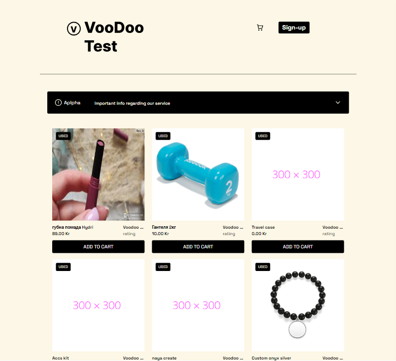
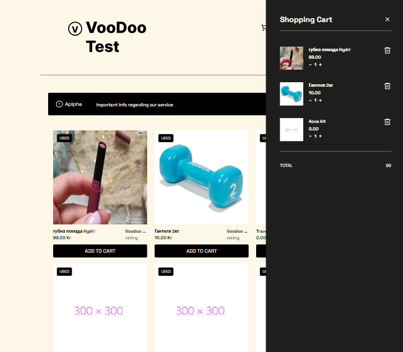

# VooDoo Online

StoreVooDoo is an online store project that offers users the ability to browse
and purchase products online. This project implements various e-commerce
functionalities, including a shopping cart for adding and managing items. The
shopping cart dynamically calculates the total cost of the items added, and the
cart data persists even after refreshing the page. The project also features
responsive web design for an optimal user experience across different devices.
 

# Features

- Shopping Cart: Users can add products to their shopping cart and manage the
  items in it.

- Total Cost Calculation: The shopping cart instantly calculates the total cost
  of all the added items.

- Data Persistence: Cart data is stored in local storage, ensuring that users
  don't lose their items even after refreshing the page or closing the browser.

- Responsive Design: The website layout and design are responsive, providing an
  optimal viewing experience on desktops, tablets, and smartphones.
